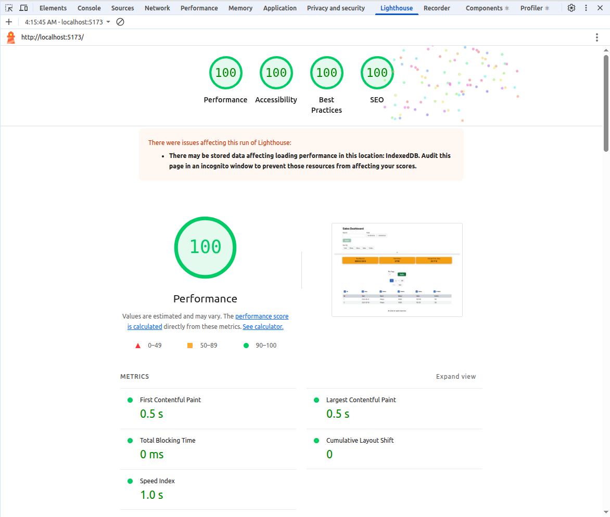

## ⚠️ Node.js First-run “Pre-transform” Notice

As of **08.01.2026**, in larger projects using React Router v7 (`react-router`) + Vite, the first run of the dev server (`npm run dev`) may produce temporary errors like:

`Failed to load resource: the server responded with a status of 504 (Outdated Optimize Dep)
Uncaught (in promise) TypeError: Failed to fetch dynamically imported module: 
Failed to load resource: the server responded with a status of 504 (Outdated Optimize Dep)`

This happens because Vite tries to pre-transform dependencies before React Router generates the `.react-routes` folder. In smaller projects, this error often does not appear because `.react-routes` is generated almost instantly.
This is only a first-run dev server issue. Production builds (SSR) are not affected, because `react-router` build generates all necessary files beforehand.

Solution:

- Refresh the browser using `Ctrl + Shift + R` (works on the second load)

---

# React 19 + TypeScript + Vite + React Router + Tailwind

A modern, production-ready template for building full-stack React applications using React Router.



## Main Features

- 🚀 Server-side rendering
- ⚡️ Hot Module Replacement (HMR)
- 📦 Asset bundling and optimization
- 🔄 Data loading and mutations
- 🔒 TypeScript by default
- 🎉 TailwindCSS for styling
- 📖 [React Router docs](https://reactrouter.com/)

## Routes

- `/` (**Home**)  
  Displays **table only**.  
  Shares data with `/charts`.

  With filters `/?channelName=p&minDate=2024-09-01&maxDate=2024-09-29`

- `/charts` (**Charts**)  
  Displays **charts only**.  
  Shares data with `/`.

  With filters `/charts?channelName=p&minDate=2024-09-01&maxDate=2024-09-29`

## Getting Started

`node >= v22`

I use:

`node: v22.21.1`
`npm: 11.7.0`

### Environment Variables

Before running the project, create a `.env` file based on the provided example:

```bash
cp .env.example .env
```

### Installation

Install the dependencies:

```bash
npm install
```

### Development

Start the development server with HMR:

```bash
npm run dev
```

Your application will be available at `http://localhost:5173`.

### Available Scripts

This template comes with several useful scripts for development, formatting, linting, type checking, and testing.

| Script           | Description                                                                                                 |
| ---------------- | ----------------------------------------------------------------------------------------------------------- |
| `npm run tc`     | Run React Router type generation and TypeScript compiler checks (`react-router typegen && tsc`).            |
| `npm run lint`   | Run ESLint to check for code issues.                                                                        |
| `npm run format` | Format all code and styles using Prettier (`prettier --write 'app/**/*.{ts,tsx,js,jsx,json,css,scss,md}'`). |
| `npm run test`   | Run tests with Vitest (`vitest --config vite.config.test.ts`).                                              |
| `npm run test:f` | Run tests in update snapshot mode (`npm run test -- -u`).                                                   |

## Building for Production

Create a production build:

```bash
npm run build
```

## Deployment

### Docker Deployment

To build and run using Docker:

```bash
docker build -t my-app .

# Run the container
docker run -p 3000:3000 my-app
```

The containerized application can be deployed to any platform that supports Docker, including:

- AWS ECS
- Google Cloud Run
- Azure Container Apps
- Digital Ocean App Platform
- Fly.io
- Railway

### DIY Deployment

If you're familiar with deploying Node applications, the built-in app server is production-ready.

Make sure to deploy the output of `npm run build`

```
├── package.json
├── package-lock.json (or pnpm-lock.yaml, or bun.lockb)
├── build/
│   ├── client/    # Static assets
│   └── server/    # Server-side code
```

## Team members

[@thomson159](https://github.com/thomson159)

---
